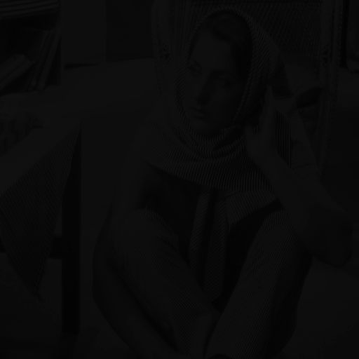

# Light Image Processor

****
###### A light image processor made during the OOP class in the second semester of first year at Babes Bolyai - MIE, coded in C++

***
### Little Showcase:

#### - Base image:

#### - Brightness:

#### - Gamma Correction:

#### - HaHa FuNNy:

